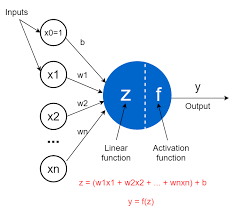
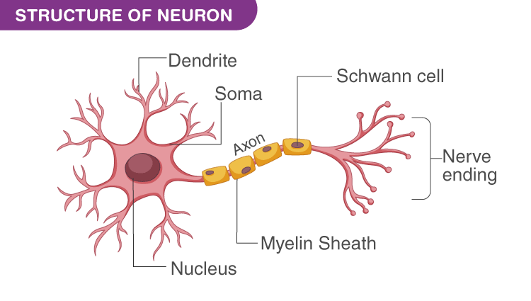

# Day 3 – Perceptron (Basic Structure & Working)  
## 100 Days of Deep Learning 🚀

---

# What is a Perceptron?

A **Perceptron** is the simplest form of an artificial neural network used for **binary classification**.  
It computes a weighted sum of inputs and passes it through an activation function to produce an output.

---

# Basic Structure

---

# Mathematical Representation

### Inputs:
x1, x2, x3, ..., xn  

### Weights:
w1, w2, w3, ..., wn  

### Bias:
b  

### 1️⃣ Summation (Linear Combination)

z = (w1x1 + w2x2 + ... + wnxn) + b  

### 2️⃣ Activation Function (Step Function)

Output =  
1  if z ≥ 0  
0  if z < 0  

---

# What is an Activation Function?

An **activation function** decides whether a neuron should activate (produce output) or not.  

In a perceptron, we use a **step function**, which converts the linear output into a binary result (0 or 1).

---

# Working of Perceptron

### Training Phase:
- Provide input features and labeled outputs.
- The model learns by adjusting **weights and bias**.
- Goal: Minimize classification error.

### Testing Phase:
- Use learned weights and bias.
- Compute z.
- Apply activation function.
- Generate final prediction.

---

# Perceptron vs Biological Neuron (Very Short Comparison)

| Biological Neuron | Perceptron |
|-------------------|------------|
| Dendrites receive signals | Inputs (x) |
| Synapses control signal strength | Weights (w) |
| Cell body sums signals | Summation (z) |
| Axon sends output | Output |
| Threshold firing | Step activation |

---

🔥 Day 3 Complete!